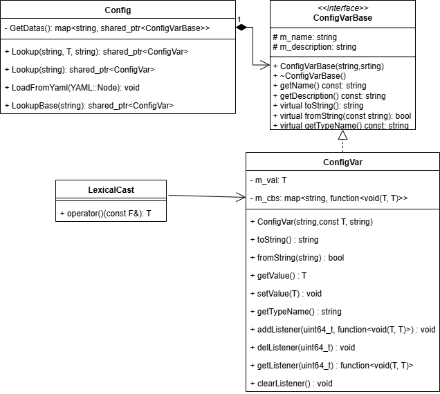

# 配置系统
通过配置文件，给日志系统配置输出格式、文件路径等
Config ---->  yaml文件解析

- 原则：约定大于配置

## 系统设计
- Config
    - LookupBase(str):ConfigVarBase
    - Lookup(prefix, obj, description): ConfigVar<T>::ptr
    - LoadFromYaml：从模板中加载配置
- ConfigVarBase
- ConfigVar：public ConfigVarBase (通过模板偏特化方式进行转换，定义一个类型转换类，重载其()运算发，以仿函数的形式实现类型转换)
    - toString
    - fromString --> setValue(new_value) : oldValue(m_val--成员变量) --> 执行listener的callback
### UML


## 必要组件
- 安装boost库
```shell
sudo apt update
sudo apt install libboost-all-dev
```
- 安装yaml-ccp库
```shell
mkdir build
cd build
cmake ..
make install
```
- 常用的查询命令
```shell
find . *.h | xargs grep -inr load

# xargs：该命令可以把前面命令的返回值作为后面命令的参数
# find . *.h：可以递归查找当前目录下的.h文件
# grep：选线-inr，i表示忽略大小写，n表示打印查找到的行号，r表示递归查询(本例中可以不用)
```

- 模板

1. 例子
```c++
template<calss T, class FromStr, classToStr>
class ConfigVar{};

// 使用到了仿函数，转换的基本模板
template<class F, class T> 
class LexicalCast
{
public:
    T operator()(const F& v)
    {
        return boost::lexical_cast<T>(v);
    }
}；

// 转换的偏特化模板，string to vector的转化
template<class T>
class LexicalCast<std::string, std::vector<T>>
{
    std::vector<T> operator()(const std::string& v)
    {
        YAML::Node node = YAML::Load(v)； // 支持从string转化为YAML::Node类型
        typename std::vector<T> vec;
        std::stringstream ss;
        for(size_t i = 0； i < node.size(); ++i)
        {
            ss.str(""); // 清空缓冲区
            ss << node[i];
            vec.push_back(LexicalCast<std::string, T>()(ss.str()));
        }

        return vec;
    }
}


// 转换的偏特化模板，vector to string的转
template<class T>
class LexcialCast<std::vector<T>, std::string>
{
public:
    std::string operator()(const std::vector<T>& v)
    {
        YAML::Node node;

        for(auto& i: v)
        {
            node.push_back(YAML::Load(LexicalCast<T, std::string>()(i)));
        }
        std::stringstream ss;
        ss << node;
        return ss.str();
    }
}

// set: 具备排序 和 去重功能
// unordered_set: 无序 具备去重
```

2. 思路
- 最初思路：只能将基本类型的值进行字符串化，使用lexical_cast进行转换，有局限性，对于复杂类型无法适应
- 当前思路：为了支持复杂类型的转化，通过使用模板来实现。例如针对vector类型的转换，进行偏特化声明，这样后期在实例化一个```std::vector<int>```类型的对象时，就可以实例化偏特化的模板，而不会使用原本的基础模板。


3. 配置变更事件
- 配置的事件机制：当某个配置项发生改变后，可以反向通知对应的代码，回调
- 实现方式
    1. 在配置项类中添加listener，通过map存储，并添加addListener、delListener、getListener、clearListener方法
    2. map的second参数设置为function类型，参数列表为oldvalue和newvalue，用于对比。回调函数内部用来执行发生变更后的一些操作。

4. 配置模板详情----日志模块
```yaml
logs:
    - name: root
      level: (debug/info/warn/error/fatal)
      formatter: '%d%T%p%T%t%m%n'
      appender:
        - type: (SoutLogAppender/FileLogAppender)
          level: (debug/info/warn/error/fatal)
          file: ../log/log.txt
```